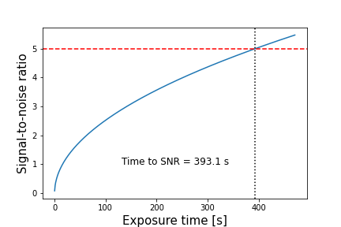

# Exposure time calculator for Mt John telescopes and instruments.

This package will give estimates for the signal to noise ratio possible for given instrument setup and conditions, such as Moon phase.

You can pip install mj_etc as:
```bash
pip install git+https://github.com/CheerfulUser/mt_john_etc.git
```

Once installed the etc can be called as follows. In this example we will calculate the time required to reach a SNR of 5 for a 22nd mag object with the 1.8m using the moaR filter on the MOA camera.

```python
from mj_etc import ETC
etc = ETC('moaR','MOA','1.8m',moon_phase='bright')
etc.time_for_snr(5,mag=22,plot=True)
```


So we can see that a SNR of 5 should be achieved with a 400s exposure during bright time.

Possible telescopes and detector combinations currently are:
	- B&C (0.6m; FLI imager)
	- OC (0.6m, robotic; FLI imager)
	- 1m (FLI imager)
	- 1.8m (MOA imager)

We can set the sky brightness with the `moon_phase` variable. Options for Moon phase are:
	- bright
	- grey
	- dark

Please report and issues to: ryan.ridden@canterbury.ac.nz